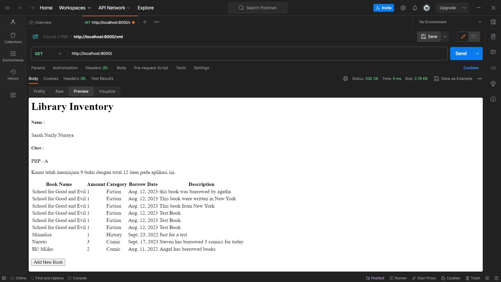
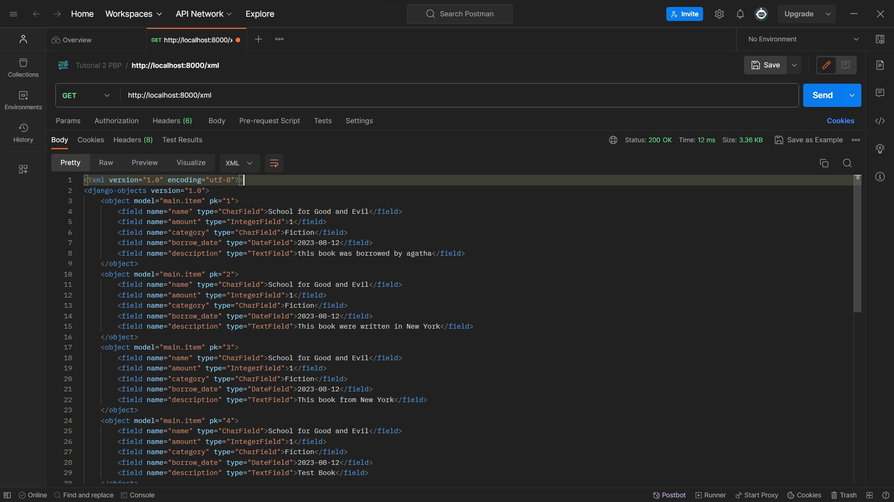
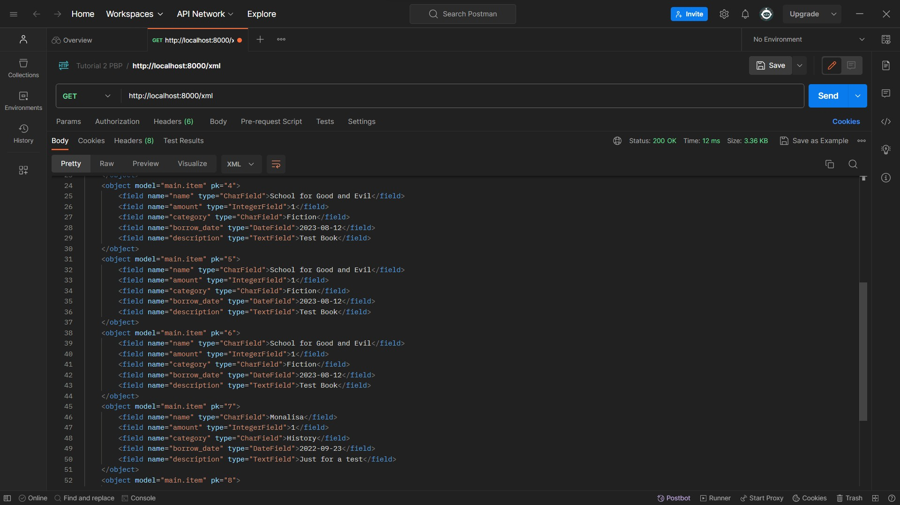
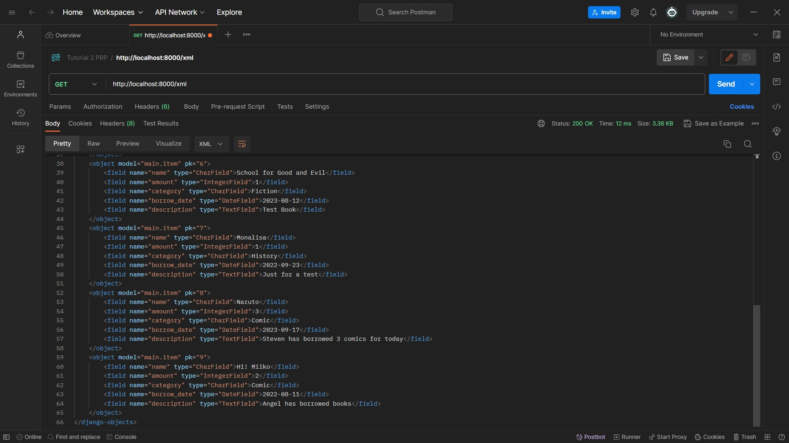
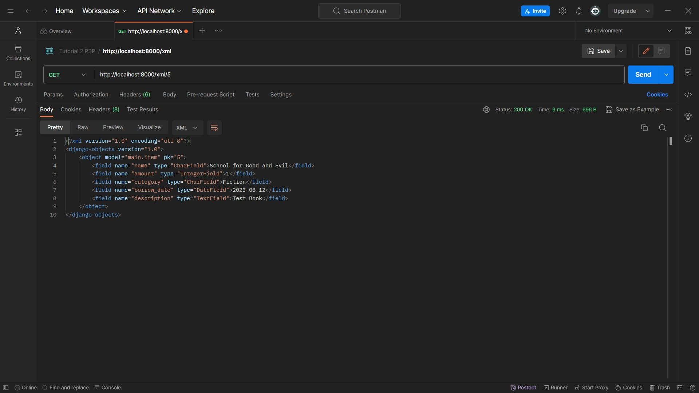
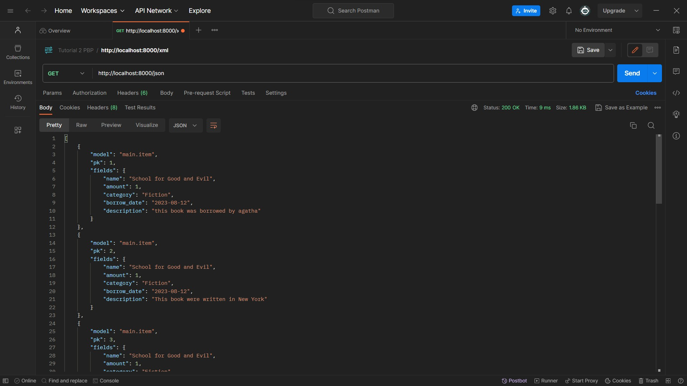
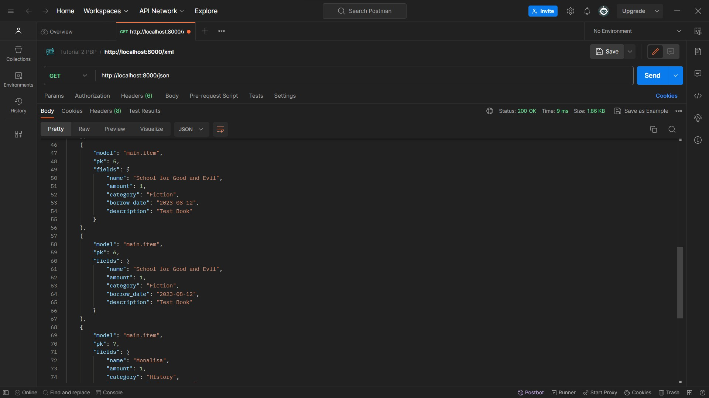
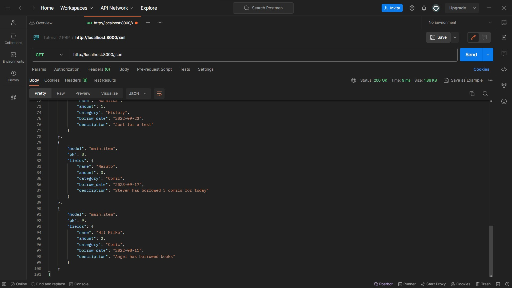
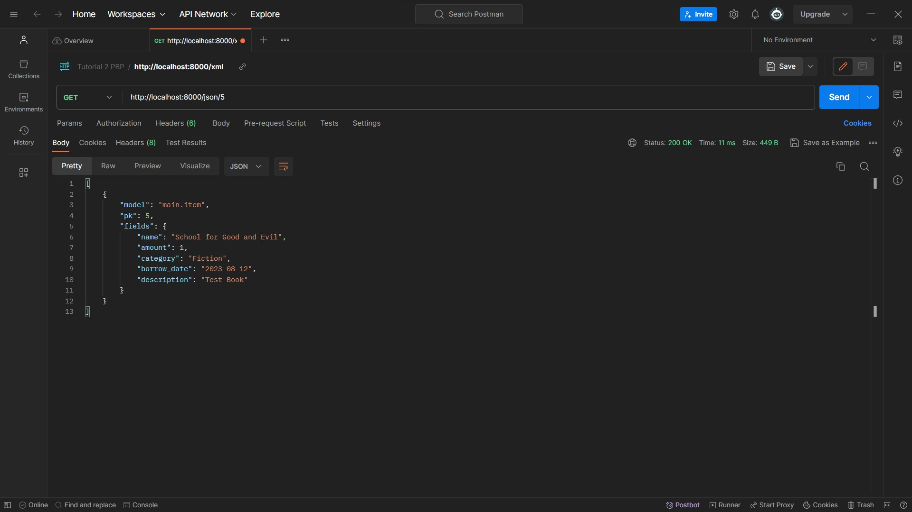

# Penjelasan Tugas PBP
Nama    : Sarah Nazly Nuraya

NPM     : 2206082581

Kelas   : PBP-A

Link App Adaptable :  https://sarah-library.adaptable.app

<details>

<summary> Tugas 2 </summary>

<h1>Langkah Pembuatan Project Library Inventories</h1>

<h2>Melakukan aktivasi Virtual Environment</h2>

Hal ini dilakukan untuk mengisolasi **package** serta *dependencies* dari aplikasi sehingga tidak terjadi tabrakan dengan versi lain yang terdapat dalam komputer.

<h2>Membuat Proyek Django Baru</h2>

Untuk mengawali pembuatan project, saya melakukan instalasi *dependecies* dengan melakukan perintah `pip install -r requirements.txt` dan kemudian membuat proyek Django dengan nama library_inventory dengan perintah `django-admin startproject library_inventory`

<h2>Konfigurasi Proyek dan Menjalankan Server</h2>

Pada bagian ini saya mengizinkan akses aplikasi web dengan menambahkan `*` pada `ALLOWED_HOST` di `settings.py` dalam direktori proyek library_inventory. Kemudian untuk memastikan direktori aktif saya melakukan pemeriksaan dengan menjalankan perintah `python manage.py runserver`

<h2>Membuat Aplikasi Main</h2>

Setelah memiliki proyek Django, saya membuat aplikasi `main` dalam direktori proyek library_inventory. Aplikasi ini merupakan unit dari proyek Django yang mengatur fungsi-fungsi khusus dalam proyek yang sedang dibuat. Pembuatan aplikasi main dilakukan dengan perintah `python manage.py startapp main`  

<h2>Melakukan Routing</h2>

Langkah ini dilakukan untuk mengarahkan URL ke aplikasi main yang telah dbuat. Hal ini dilakukan dengan menambahkan routing ke file `urls.py` yang ada pada direktori proyek library_inventory dengan menambahkan `path('', include('main.urls'))`. Dengan begitu semua permintaan ke URL utama akan diteruskan ke main untuk diproses.

<h2>Membuat Model Item</h2>

Untuk mendefinisikan struktur data pada proyek ini, saya membuat model Item dalam file `models.py` yang terdapat dalam aplikasi main untuk mendefinisikan atribut, seperti name, amount, description, category, dan tanggal peminjaman.

<h2>Membuat Fungsi Views.py</h2>

Untuk mengatur logika dari proyek aplikasi ini, maka saya membuat fungsi items dalam file `views.py` yang terdapat dalam aplikasi main. Fungsi ini akan mengambil data dari model Item dan melakukan render ke dalam template HTML.

<h2>Membuat Routing pada Fungsi</h2>

Saya melakukan pendefinisian routing untuk fungsi yang telah dibuat di file `views.py` dalam file `urls.py`. Routing ini akan menentukan bagaimana HTTP akan mencapai fungsi yang tepat di aplikasi main ketika URL tertentu diakses.

<h2>Implementasi Template HTML</h2>

Saya membuat template HTML pada direktori baru di dalam aplikasi main. Template ini akan digunakan untuk mengatur tampilan halaman web yang akan diberikan kepada pengguna. Data yang diperoleh program dari `views.py` akan dimasukkan ke dalam template ini.

<h2>Testing Django</h2>

Saya melakukan test dari proyek ini dengan membuat unit test dan membuat TestCase dengan menggunakan models dari proyek `library_inventory`. Hal ini dilakukan untuk melakukan pengujian terhadap atribut yang terdapat dalam proyek.

<h2>Add, Push, dan Commit ke dalam Repositori GitHub</h2>

Setelah proses testing berhasil maka saya melakukan proses pengunggahan proyek ke repository Library-Inventory pada GitHub. Sebelum melakukan pengunggahan, saya membuat sebuah file `.gitignore` yang digunakan untuk menentukan berkas dan direktori yang harus diabaikan ole Git. Setelah itu barulah dilakukan add, commit, dan push ke repositori GitHub.

<h2>Deployment ke Adaptable</h2>

Setelah mengembangkan aplikasi secara lokal, maka saya melakukan deployment ke server atau platform hosting yang dapat diakses secara online dan memungkinkan untuk diakses oleh orang lain melalui internet.

<h2>Membuat README.md</h2>

Setelah semuanya selesai, saya membuat file `README.md` ini yang berisikan link dari aplikasi pada Adaptable dan menjawab pertanyaan seputar proyek aplikasi ini. Kemudian setelah selesai maka kembali melakukan add, commit, dan push ke repositori GitHub.

<h2>Melakukan deactivate pada Virtual Environment</h2>

Setelah selesai saya melakukan *deactivate* pada virtual environment karena telah selesai digunakan.

<h1>Bagan *request client* ke web aplikasi Django dan kaitannya antara urls.py, views.py, models.py, dan berkas HTML</h1>

Bagan 

        **Client's Web Browser**
                    ^
                    |
                    v
        **Django Web Application**
                    ^
                    |
                    v
                    |
    **urls.py** <---+--------->  **views.py**
                    |                 |
                    v                 v
                **models.py**   **items.html**
                    |
                    v
                **database**

**Client Web Browser** sebuah *request* dimulai dari web browser pengguna atau *client* ketika mereka memasukkan URL atau mengklik link. Kemudian permintaan tersebut akan diterima oleh aplikasi **web yang berbasis Django** dan diproses serta mengirimkan respon kembali ke *client*. File `urls.py` bertanggung jawab untuk menentukan bagaimana permintaan URL ini akan diarahkan dan menghubungkan URL yang diterima dari *client* dengan fungsi tindakan yag disesuaikan pada `views.py`. Ketika permintaan URL diteruskan oleh `urls.py`, `views.py` mengambil alih untuk memproses permintaan tersebut. `views.py` dapat mengakses model untuk memproses data dan merender `items.html` atau mengembalikan respins JSON, tergantung pada kasus penggunaan. `models.py` akan menggambarkan struktur data dalam aplikasi dan memberikan definisi model yang digunakan untuk berinteraksi dengan database atau data lainnya. `models.py` dapat digunakan oleh `views.py` untuk mengambil atau penyimpan data. `items.html` digunakan untuk mengatur tampila yang akan diberikan kepada pengguna atau *client*. `views.py` dapat merender `items.html` dengan data yang diambil dari model dan kemudian mengirimkannya kembali ke *client* sebagai respons HTML yang siap ditampilkan.

<h1>Alasan Menggunakan Virtual Environment dan Apa yang Terjadi Apabila Tidak Menggunakan Virtual Environment</h1>

Virtual environment digunakan untuk mengisolasi lingkungan dari pengembangan python dan hal ini akan memungkinkan penggunaan *package* dan dependensi proyek yang spesifik. Dengan digunakannya virtual environment, maka hal tersebut dapat membantu dalam mencegah konflik antar proyek dan menjaga kestabilan dari proyek. Selain itu kita dapat melakukan pengelolaan versi python dan *package* yang berbeda untuk setiap proyek dan terhindar dari masalah kompabilitas.
Kita tetap dapat membuat aplikasi Django tanpa virtual environment, namun hal tersebut tidak disarankan karena memungkinkan terjadinya konflik antar *package*, kesulitan pengelolaan berbagai versi python, dan juga adanya kesulitan dalam mengisolasi dependensi proyek yang berbeda.

<h1>MVC, MVT, MVVM, dan Perbedaannya</h1>

<h2>MVC</h2>

*Model View Controller* adalah suatu model yang komponennya terbagi menjadi 3, yaitu Model, View, dan Controller. Komponen `model` berisikan logika dan status data yang terdapat dalam aplikasi. Komponen ini bertugas untuk mendapatkan dan memanipulasi data, berinteraksi dengan controller, berinteraksi dengan database, dan memperbarui tampilan dari aplikasi yang dikembangkan. Komponen `view` berhubungan dengan *interface* pengguna yang terdiri dari HTML/CSS.XML. View bekerjasama dengan controller untuk menciptakan tampilan yang dinamis. Komponen `controller` merupakan suatu komunikator antara view dan model.

<h2>MVT</h2>

*Model View Template* adalah suatu model yang komponennya terbagi menjadi 3, yaitu Model, View, dan Template. Komponen `model` berfungsi untuk mengelola data dan logika dari aplikasi. Komponen `template` merupakan komponen yang berhubungan dengan *interface* pengguna. Komponen ini bekerjasama dengan `view` yang merupakan komponen komunikator dari model dan template untuk menciptakan tampilan yang dinamis.

<h2>MVVM</h2>

*Model View ViewModel* merupakan suatu model yang komponennya terbagi menjadi 3, yaitu Model, View, dan ViewModel. Komponen `model` berfungsi untuk mengelola data yang digunakan untuk menjalankan suatu aplikasi. Komponen `view` berfungsi sebagai *interface* grafis antara pengguna dengan pola desain. Komponen ini juga berfungsi untuk menampilkan output dari data yang telah diproses. Komponen `ViewModel` di salah satu sisi merupakan abstraksi dari komponen `view`, namun di sisi yang lain komponen ini berfungsi sebagai penyedia pembungkus data model untuk ditautkan.

<h2>Perbedaan</h2>

- MVP dengan MVT
: MVT merupakan varian dari MVC yang digunakan dalam kerangka kerja Django. Pada MVT komponen `view` berperan seperti `controller` dalam MVC, sementara komponen `template` berperan seperti `view` dalam MVC.
- MVVM dengan MVC/MVT
: MVVM lebih umum untuk digunakan dalam pengembangan aplikasi berbasis kerangka kerja JavaScript, sementara MVC/MVT biasanya terkait dengan pengembangan server-side seperti Django. Kemudian MVVM juga dirancang untuk lebih memisahkan logika tampilan dari komponen `model` jika dibandingkan dengan MVC/MVT.

<h1>Referensi</h1>

- https://pythonistaplanet.com/difference-between-mvc-and-mvt/#google_vignette
- https://agus-hermanto.com/blog/detail/mvc-vs-mvp-vs-mvvm-apa-perbedaannya-mana-yang-terbaik-diantara-ketiganya-a
- https://pbp-fasilkom-ui.github.io/ganjil-2024/
- https://www.petanikode.com/python-virtualenv/

</details>

<details>

<summary> Tugas 3 </summary>

<h1>Perbedaan POST dan GET dalam Django</h1>

1. POST 
<p>form POST digunakan untuk melakukan pengiriman data ke server dalam permintaan HTTP. Data tersebut tidak ditampilkan dalam URL dan form POST digunakan ketika user ingin mengirim data yang sensitif atau besar. form POST tidak dibatasi oleh panjang string dan lebih aman. Pengambilan variable dilakukan dengan `request.POST.get`, form POST ini juga biasanya digunakan untuk input data melalui form.</p>

2. GET
<p>form GET digunakan untuk mengambil data dari server. Data dikirimkan sebagai bagian dari URL, sehingga dapat dilihat oleh semua orang yang melihat URL tersebut, sehingga form GET digunakan untuk permintaan pencarian atau pengambilan data yang tidak sensitif. form GET cenderung tidak aman dan memiliki batasan panjang string yang hanya sampai 2047 karakter. Pengambilan variabel dapat dilakukan dengan `request.GET.get('query', '')`.</p>

<h1>Perbedaan Utama XML, JSON, dan HTML dalam Pengiriman Data</h1>

1. XML (eXtensible Markup Language)
- **Tujuan Utama** : XML digunakan untuk menggambarkan dan mengirimkan data terstruktur antara komputer atau aplikasi.
- **Struktur** : XML memiliki struktur yang ketat dan harus mengikuti aturan sintaksis yang sesuai. Data dalam XML didefinisikan oleh tag dan atribut.
- **Fleksibilitas** : XML sangat fleksibel dan dapat digunakan untuk mewakili berbagai jenis data yang terstruktur.
- **Pemrosesan** : Parsing XML memerlukan upaya lebih dalam pengelolaan data karena XML cenderung lebih lengkap dan formal.
- **Penggunaan Umum** : XML sering digunakan untuk pertukaran data antara aplikasi yang berbeda, seperti Web Services dan konfigurasi file.

2. JSON (JavaScript Object Notation)
- **Tujuan Utama** : JSON digunakan untuk pertukaran data ringan dan pembacaan oleh mesin antara aplikasi web dan server.
- **Struktur** : JSON memiliki struktur yang lebih sederhana dibandingkan XML. Data dalam JSON didefinisikan dalam format pasangan "key-value" yang mirip dengan objek JavaScript.
- **Fleksibilitas** : JSON cocok untuk data terstruktur seperi array dan objek. JSON lebih cocok untuk data yang akan digunakan dalam bahasa pemrograman modern.
- **Pemrosesan** : Parsing JSON lebih mudah dan lebih cepat karena formatnya lebih ringkas dan sesuai dengan JavaScript.
- **Penggunaan Umum** : JSON digunakan secara luas dalam pengembangan aplikasi web modern dan sebagai format data dalam RESTful API.

3. HTML (Hypertext Markup Language)
- **Tujuan Utama** : HTML digunakan untuk membuat struktur dan tampilan halaman web, bukan untuk pertukaran data. Namun, dapat digunakan untuk menampilkan data dalam format yang dapat dibaca oleh manusia.
- **Struktur** : HTML memiliki struktur yang khusus untuk membuat elemen-elemen tampilan seperti paragraf, tabel, gambar, dan hyperlink.
- **Fleksibilitas** : HTML tidak sefleksibel XML atau JSON dalam hal menggambarkan data terstruktur. HTML lebih terfokus pada presentasi data.
- **Penggunaan Umum** : HTML adalah bahasa standar untuk membuat halaman web. Browser web dapat menginterpretasikan HTML dan menampilkannya sebagai halaman web yang dapat dilihat oleh pengguna.

<h1>Alasan Digunakannya JSON Pada Web Modern</h1>

- JSON adalah format data ringkas yang mudah dibaca dan dimengerti oleh manusia, sehingga membuatnya sangat berguna dalam komunikasi antara aplikasi web dan server.
- JSON digunakan secara luas dalam pengembangan web dan dapat diuraikan dan dibuat dengan mudah menggunakan bahasa pemrograman seperti JavaScript, Python, dan bahasa lainnya.
- Karena ringan dan efisien, JSON meminimalkan beban lalu lintas jaringan saat mengirim data antara aplikasi web, yang mana merupakan aspek penting dalam kinerja aplikasi yang responsif.

<h1>Implementasi Checklist</h1>

<h2>Membuat Form Input Data dan Menampilkan Data Produk</h2>

Untuk membuat bagian input form dari aplikasi peminjaman buku, pada folder `main` dibuat file baru dengan nama `forms.py` untuk membuat struktur form yang dapat menerima data produk baru dengan menambahkan kode berikut.

``` python
from django.forms import ModelForm
    from main.models import Item
    
    class ItemForm(ModelForm):
        class Meta:
            model = Item
            fields = ["name", "amount", "category", "borrow_date", "description"] 
```

dimana `model = Item` untuk menunjukkan model yang akan digunakan untuk form dan `fields` yang akan menunjukkan field dari model Item yang digunakan untuk form.

<h2>Menghubungkan forms.py dengan views.py</h2>

Pada file `views.py` yang ada pada folder `main` dengan menambahkan import yang dibutuhkan dan membuat fungsi baru `borrow_books` yang menerima parameter `request` dan menghasilkan formulisr untuk menambahkan data buku yang ingin dipinjam.

```python
from django.http import HTTpResponseRedirect
from main.forms import ItemForm, Item
from django.urls import reverse

def borrow_books(request):
    form = ItemForm(request.POST or None)

    if form.is_valid() and request.method == "POST":
        form.save()
        return HttpResponseRedirect(reverse('main:items'))
    
    context = {'form' : form}
    return render(request, "borrow_books.html", context)
```

form pada kode tersebut digunakan untuk membuat form item baru berdasarkan input dari user dengan menggunakan form POST dan melakukan redirect ke `items` setelah data pada form berhasil disimpan.

<h2>Mengubah fungsi `items` untuk memanggil objek buku pada database</h2>

Untuk mengambil object pada database, di fungsi `items` dilakukan pengubahan menjadi seperti berikut.

```python
def items(request) :
    books = Item.objects.all()

    total_book = sum([book.amount for book in books])
    
    context = {
        'application' : 'Library Inventories',
        'name' : 'Sarah Nazly Nuraya',
        'class' : 'PBP - A',
        'books' : books,
        'total_book' : total_book,
    }
    
    return render(request, 'items.html', context)
```

<h2>Melakukan root URL `borrow_books`</h2>

Karena pada `urls.py` sudah dilakukan import
```python
from . import views
```
Maka tidak diperlukan lagi menambahkan nama fungsi untuk diimport karena sudah secara otomatis program akan menambahkan semua fungsi yang ada dalam `views.py`. Oleh karena itu saya hanya menambahkan *path url* ke dalam `urlpatterns` pada `urls.py` untuk mengakses fungsi `borrow_books`.
```python
...
path('borrow-books/', views.borrow_books, name='borrow-books'),
```

<h2>Membuat Halaman untuk Input Form</h2>

Agar kita dapat melakukan input form buku yang ingin dipinjam, maka dibutuhkan laman yang menampilkan tabel yang dapat diisi dengan data buku. Oleh karena itu perlu dibuat file HTML baru `borrow_books.html` yang berisikan kode berikut.
```html
 


<h1>Borrow a Book</h1>

<form method="POST">
    
    <table>
        {{ form.as_table }}
        <tr>
            <td></td>
            <td>
                <input type="submit" value="Add Book"/>
            </td>
        </tr>
    </table>
</form>


```
Kode tersebut akan memberikan fields form seperti yang sudah dibuat pada `forms.py` sebagai *table* dan juga memberikan tombol *submit* untuk mengirimkan *request* ke *view*.

<h2>Memperlihatkan Produk yang Sudah di-input pada Input Form di Halaman Utama</h2>

Untuk menampilkan data yang sudah ditambahkan pada input form, pada file `main.html` dapat ditambahkan `` dan juga memberikan tampilan table yang berisikan data inputan form sebagai berikut.
```html



<h1>Library Inventory</h1>

    <h5>Name    :</h5>
    <p>{{ name }}</p>

    <h5>Class   :</h5>
    <p>{{ class }}</p>

    <p>Kamu telah meminjam {{ books|length }} buku dengan total {{ total_book }} item pada aplikasi ini.</p>

<table>
    <tr>
        <th>Book Name</th>
        <th>Amount</th>
        <th>Category</th>
        <th>Borrow Date</th>
        <th>Description</th>
    </tr>

    
        <tr>
            <td>{{item.name}}</td>
            <td>{{item.amount}}</td>
            <td>{{item.category}}</td>
            <td>{{item.borrow_date}}</td>
            <td>{{item.description}}</td>
        </tr>
    
</table>

<br />

<a href="">
    <button>
        Add New Book
    </button>
</a>


```
Kemudian jalankan aplikasi dengan perintah `python manage.py runserver`.

<h2>Menambahkan Fungsi Mengembalikan Data dalam XML</h2>

Pada file `views.py` perlu diberikan tambahan import `HttpResponse` dan `serializers` yang dapat melakukan translate objek model menjadi format XML. Kemudian perlu untuk dibuat fungsi tambahan `show_xml` yang dapat menyimpan hasil *query* dari data pada `Item` dan melakukan return menjadi XML.
```python
from django.http import HttpResponse
from django.core import serializers
```
```python
def show_xml(request):
    data = Item.objects.all()
    
    return HttpResponse(serializers.serialize("xml", data), content_type='application/xml')
```
Untuk melakukan return hasil *query* berdasarkan ID tertentu maka perlu ditambahkan parameter id yang nantinya akan disimpan dalam variabel sesuai dengan ID tertentu pada `Item`.
```python
def xml_by_id(request, id):
    data = Item.objects.filter(pk=id)

    return HttpResponse(serializers.serialize("xml", data), content_type="application/xml")
```

<h2>Menambahkan Fungsi Mengembalikan Data dalam JSON</h2>

Untuk menampilkan data dalam format JSON diperlukan fungsi baru `show_json` yang menyimpan hasil *query* berdasarkan data pada `Item` dan melakukan return menjadi JSON.
```python
def show_json(request):
    data = Item.objects.all()

    return HttpResponse(serializers.serialize("json", data), content_type="application/json")
```
Untuk melakukan return hasil *query* berdasarkan ID tertentu maka perlu ditambahkan parameter id yang nantinya akan disimpan dalam variabel sesuai dengan ID tertentu pada `Item`.
```python
def json_by_id(request, id):
    data = Item.objects.filter(pk=id)

    return HttpResponse(serializers.serialize("json", data), content_type="application/json")
```

<h2>Membuat Routing URL untuk Masing-Masing Fungsi Views</h2>

Karena pada `urls.py` telah dilakukan `import . from views`, maka tidak perlu menambahkan nama fungsi di views pada import karena program secara otomatis sudah mengakses semua fungsi yang ada pada `views.py`. Oleh karena itu untuk melakukan routing hanya perlu menambahkan `urlpatterns` seperti berikut.
```python
...
path('xml/', views.show_xml, name='show_xml'),
path('json/', views.show_json, name='show_json'),
path('xml/<int:id>/', views.xml_by_id, name='xml_by_id'),
path('json/<int:id>/', views.json_by_id, name='json_by_id'),
```

<h2>Menggunakan Postman Sebagai Data Viewer</h2>

<h3>Tampilan Halaman Utama Program Library Inventory</h3>



<h3>Tampilan Data dalam XML</h3>





<h3>Tampilan Data dalam XML dengan ID 5</h3>



<h3>Tampilan Data dalam JSON</h3>






<h3>Tampilan Data dalam JSON dengan ID 5</h3>



<h2>BONUS</h2>

Untuk mengimplementasikan tampilan akumulasi data yang tersimpan dalam aplikasi, saya menambahkan dalam `items.html` kode berikut.
```html
...
<p>Kamu telah meminjam {{ books|length }} buku dengan total {{ total_book }} item pada aplikasi ini.</p>
...
```
perhitungan `total_book` telah dilakukan pada `views.py` dengan kode berikut.
```python
...
total_book = sum([book.amount for book in books])
...
```
sementara untuk `{{ books|length }}` berarti program mengambil jumlah elemen yang terdapat dalam `books`.

<h2>Melakukan Add, Commit, dan Push ke GitHub</h2>

Kita dapat melakukan `add` dari semua file yang diperbarui dengan perintah `git add .`, kemudian melakukan `commit` "Tugas 3" dengan perintah `git commit -m "Tugas 3"`, dan yang terakhir melakukan `push` ke repository GitHub dengan perintah `git push -u origin main`.

<h1>Referensi</h1>

- https://pbp-fasilkom-ui.github.io/ganjil-2024/docs/tutorial-2
- https://gist.github.com/rririanto/442f0590578ca3f8648aeba1e25f8762
- https://developer.mozilla.org/en-US/docs/Learn/JavaScript/Objects/JSON
- https://developer.mozilla.org/en-US/docs/Web/HTML
- https://www.w3schools.com/xml/

</details>