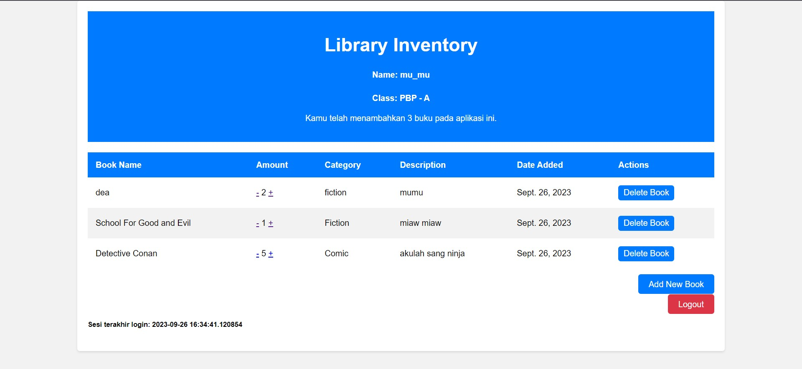
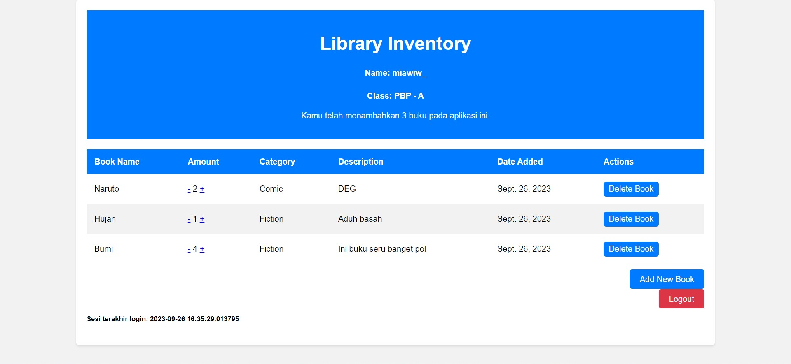

# Penjelasan Tugas PBP
Nama    : Sarah Nazly Nuraya

NPM     : 2206082581

Kelas   : PBP-A

Link App Adaptable :  https://sarah-library.adaptable.app

<details>

<summary> Tugas 2 </summary>

<h1>Langkah Pembuatan Project Library Inventories</h1>

<h2>Melakukan aktivasi Virtual Environment</h2>

Hal ini dilakukan untuk mengisolasi **package** serta *dependencies* dari aplikasi sehingga tidak terjadi tabrakan dengan versi lain yang terdapat dalam komputer.

<h2>Membuat Proyek Django Baru</h2>

Untuk mengawali pembuatan project, saya melakukan instalasi *dependecies* dengan melakukan perintah `pip install -r requirements.txt` dan kemudian membuat proyek Django dengan nama library_inventory dengan perintah `django-admin startproject library_inventory`

<h2>Konfigurasi Proyek dan Menjalankan Server</h2>

Pada bagian ini saya mengizinkan akses aplikasi web dengan menambahkan `*` pada `ALLOWED_HOST` di `settings.py` dalam direktori proyek library_inventory. Kemudian untuk memastikan direktori aktif saya melakukan pemeriksaan dengan menjalankan perintah `python manage.py runserver`

<h2>Membuat Aplikasi Main</h2>

Setelah memiliki proyek Django, saya membuat aplikasi `main` dalam direktori proyek library_inventory. Aplikasi ini merupakan unit dari proyek Django yang mengatur fungsi-fungsi khusus dalam proyek yang sedang dibuat. Pembuatan aplikasi main dilakukan dengan perintah `python manage.py startapp main`  

<h2>Melakukan Routing</h2>

Langkah ini dilakukan untuk mengarahkan URL ke aplikasi main yang telah dbuat. Hal ini dilakukan dengan menambahkan routing ke file `urls.py` yang ada pada direktori proyek `library_inventory` dengan menambahkan kode berikut.
```python
path('', include('main.urls'))
``` 
Dengan begitu semua permintaan ke URL utama akan diteruskan ke main untuk diproses.

<h2>Membuat Model Item</h2>

Untuk mendefinisikan struktur data pada proyek ini, saya membuat model Item dalam file `models.py` yang terdapat dalam aplikasi main untuk mendefinisikan atribut, seperti name, amount, description, category, dan tanggal peminjaman.

<h2>Membuat Fungsi Views.py</h2>

Untuk mengatur logika dari proyek aplikasi ini, maka saya membuat fungsi items dalam file `views.py` yang terdapat dalam aplikasi main. Fungsi ini akan mengambil data dari model Item dan melakukan render ke dalam template HTML.

<h2>Membuat Routing pada Fungsi</h2>

Saya melakukan pendefinisian routing untuk fungsi yang telah dibuat di file `views.py` dalam file `urls.py`. Routing ini akan menentukan bagaimana HTTP akan mencapai fungsi yang tepat di aplikasi main ketika URL tertentu diakses.

<h2>Implementasi Template HTML</h2>

Saya membuat template HTML pada direktori baru di dalam aplikasi main. Template ini akan digunakan untuk mengatur tampilan halaman web yang akan diberikan kepada pengguna. Data yang diperoleh program dari `views.py` akan dimasukkan ke dalam template ini.

<h2>Testing Django</h2>

Saya melakukan test dari proyek ini dengan membuat unit test dan membuat TestCase dengan menggunakan models dari proyek `library_inventory`. Hal ini dilakukan untuk melakukan pengujian terhadap atribut yang terdapat dalam proyek.

<h2>Add, Push, dan Commit ke dalam Repositori GitHub</h2>

Setelah proses testing berhasil maka saya melakukan proses pengunggahan proyek ke repository Library-Inventory pada GitHub. Sebelum melakukan pengunggahan, saya membuat sebuah file `.gitignore` yang digunakan untuk menentukan berkas dan direktori yang harus diabaikan ole Git. Setelah itu barulah dilakukan add, commit, dan push ke repositori GitHub.

<h2>Deployment ke Adaptable</h2>

Setelah mengembangkan aplikasi secara lokal, maka saya melakukan deployment ke server atau platform hosting yang dapat diakses secara online dan memungkinkan untuk diakses oleh orang lain melalui internet.

<h2>Membuat README.md</h2>

Setelah semuanya selesai, saya membuat file `README.md` ini yang berisikan link dari aplikasi pada Adaptable dan menjawab pertanyaan seputar proyek aplikasi ini. Kemudian setelah selesai maka kembali melakukan add, commit, dan push ke repositori GitHub.

<h2>Melakukan deactivate pada Virtual Environment</h2>

Setelah selesai saya melakukan *deactivate* pada virtual environment karena telah selesai digunakan.

<h1>Bagan request client ke web aplikasi Django dan kaitannya antara urls.py, views.py, models.py, dan berkas HTML</h1>


        **Client's Web Browser**
                    ^
                    |
                    v
        **Django Web Application**
                    ^
                    |
                    v
                    |
    **urls.py** <---+--------->  **views.py**
                    |                 |
                    v                 v
                **models.py**   **items.html**
                    |
                    v
                **database**

**Client Web Browser** sebuah *request* dimulai dari web browser pengguna atau *client* ketika mereka memasukkan URL atau mengklik link. Kemudian permintaan tersebut akan diterima oleh aplikasi **web yang berbasis Django** dan diproses serta mengirimkan respon kembali ke *client*. File `urls.py` bertanggung jawab untuk menentukan bagaimana permintaan URL ini akan diarahkan dan menghubungkan URL yang diterima dari *client* dengan fungsi tindakan yag disesuaikan pada `views.py`. Ketika permintaan URL diteruskan oleh `urls.py`, `views.py` mengambil alih untuk memproses permintaan tersebut. `views.py` dapat mengakses model untuk memproses data dan merender `items.html` atau mengembalikan respins JSON, tergantung pada kasus penggunaan. `models.py` akan menggambarkan struktur data dalam aplikasi dan memberikan definisi model yang digunakan untuk berinteraksi dengan database atau data lainnya. `models.py` dapat digunakan oleh `views.py` untuk mengambil atau penyimpan data. `items.html` digunakan untuk mengatur tampila yang akan diberikan kepada pengguna atau *client*. `views.py` dapat merender `items.html` dengan data yang diambil dari model dan kemudian mengirimkannya kembali ke *client* sebagai respons HTML yang siap ditampilkan.

<h1>Alasan Menggunakan Virtual Environment dan Apa yang Terjadi Apabila Tidak Menggunakan Virtual Environment</h1>

Virtual environment digunakan untuk mengisolasi lingkungan dari pengembangan python dan hal ini akan memungkinkan penggunaan *package* dan dependensi proyek yang spesifik. Dengan digunakannya virtual environment, maka hal tersebut dapat membantu dalam mencegah konflik antar proyek dan menjaga kestabilan dari proyek. Selain itu kita dapat melakukan pengelolaan versi python dan *package* yang berbeda untuk setiap proyek dan terhindar dari masalah kompabilitas.
Kita tetap dapat membuat aplikasi Django tanpa virtual environment, namun hal tersebut tidak disarankan karena memungkinkan terjadinya konflik antar *package*, kesulitan pengelolaan berbagai versi python, dan juga adanya kesulitan dalam mengisolasi dependensi proyek yang berbeda.

<h1>MVC, MVT, MVVM, dan Perbedaannya</h1>

<h2>MVC</h2>

*Model View Controller* adalah suatu model yang komponennya terbagi menjadi 3, yaitu Model, View, dan Controller. Komponen `model` berisikan logika dan status data yang terdapat dalam aplikasi. Komponen ini bertugas untuk mendapatkan dan memanipulasi data, berinteraksi dengan controller, berinteraksi dengan database, dan memperbarui tampilan dari aplikasi yang dikembangkan. Komponen `view` berhubungan dengan *interface* pengguna yang terdiri dari HTML/CSS.XML. View bekerjasama dengan controller untuk menciptakan tampilan yang dinamis. Komponen `controller` merupakan suatu komunikator antara view dan model.

<h2>MVT</h2>

*Model View Template* adalah suatu model yang komponennya terbagi menjadi 3, yaitu Model, View, dan Template. Komponen `model` berfungsi untuk mengelola data dan logika dari aplikasi. Komponen `template` merupakan komponen yang berhubungan dengan *interface* pengguna. Komponen ini bekerjasama dengan `view` yang merupakan komponen komunikator dari model dan template untuk menciptakan tampilan yang dinamis.

<h2>MVVM</h2>

*Model View ViewModel* merupakan suatu model yang komponennya terbagi menjadi 3, yaitu Model, View, dan ViewModel. Komponen `model` berfungsi untuk mengelola data yang digunakan untuk menjalankan suatu aplikasi. Komponen `view` berfungsi sebagai *interface* grafis antara pengguna dengan pola desain. Komponen ini juga berfungsi untuk menampilkan output dari data yang telah diproses. Komponen `ViewModel` di salah satu sisi merupakan abstraksi dari komponen `view`, namun di sisi yang lain komponen ini berfungsi sebagai penyedia pembungkus data model untuk ditautkan.

<h2>Perbedaan</h2>

- MVP dengan MVT
: MVT merupakan varian dari MVC yang digunakan dalam kerangka kerja Django. Pada MVT komponen `view` berperan seperti `controller` dalam MVC, sementara komponen `template` berperan seperti `view` dalam MVC.
- MVVM dengan MVC/MVT
: MVVM lebih umum untuk digunakan dalam pengembangan aplikasi berbasis kerangka kerja JavaScript, sementara MVC/MVT biasanya terkait dengan pengembangan server-side seperti Django. Kemudian MVVM juga dirancang untuk lebih memisahkan logika tampilan dari komponen `model` jika dibandingkan dengan MVC/MVT.

<h1>Referensi</h1>

- https://pythonistaplanet.com/difference-between-mvc-and-mvt/#google_vignette
- https://agus-hermanto.com/blog/detail/mvc-vs-mvp-vs-mvvm-apa-perbedaannya-mana-yang-terbaik-diantara-ketiganya-a
- https://pbp-fasilkom-ui.github.io/ganjil-2024/
- https://www.petanikode.com/python-virtualenv/

</details>

<details>

<summary> Tugas 3 </summary>

<h1>Perbedaan POST dan GET dalam Django</h1>

1. POST 
<p>form POST digunakan untuk melakukan pengiriman data ke server dalam permintaan HTTP. Data tersebut tidak ditampilkan dalam URL dan form POST digunakan ketika user ingin mengirim data yang sensitif atau besar. form POST tidak dibatasi oleh panjang string dan lebih aman. Pengambilan variable dilakukan dengan `request.POST.get`, form POST ini juga biasanya digunakan untuk input data melalui form.</p>

2. GET
<p>form GET digunakan untuk mengambil data dari server. Data dikirimkan sebagai bagian dari URL, sehingga dapat dilihat oleh semua orang yang melihat URL tersebut, sehingga form GET digunakan untuk permintaan pencarian atau pengambilan data yang tidak sensitif. form GET cenderung tidak aman dan memiliki batasan panjang string yang hanya sampai 2047 karakter. Pengambilan variabel dapat dilakukan dengan `request.GET.get('query', '')`.</p>

<h1>Perbedaan Utama XML, JSON, dan HTML dalam Pengiriman Data</h1>

1. XML (eXtensible Markup Language)
- **Tujuan Utama** : XML digunakan untuk menggambarkan dan mengirimkan data terstruktur antara komputer atau aplikasi.
- **Struktur** : XML memiliki struktur yang ketat dan harus mengikuti aturan sintaksis yang sesuai. Data dalam XML didefinisikan oleh tag dan atribut.
- **Fleksibilitas** : XML sangat fleksibel dan dapat digunakan untuk mewakili berbagai jenis data yang terstruktur.
- **Pemrosesan** : Parsing XML memerlukan upaya lebih dalam pengelolaan data karena XML cenderung lebih lengkap dan formal.
- **Penggunaan Umum** : XML sering digunakan untuk pertukaran data antara aplikasi yang berbeda, seperti Web Services dan konfigurasi file.

2. JSON (JavaScript Object Notation)
- **Tujuan Utama** : JSON digunakan untuk pertukaran data ringan dan pembacaan oleh mesin antara aplikasi web dan server.
- **Struktur** : JSON memiliki struktur yang lebih sederhana dibandingkan XML. Data dalam JSON didefinisikan dalam format pasangan "key-value" yang mirip dengan objek JavaScript.
- **Fleksibilitas** : JSON cocok untuk data terstruktur seperi array dan objek. JSON lebih cocok untuk data yang akan digunakan dalam bahasa pemrograman modern.
- **Pemrosesan** : Parsing JSON lebih mudah dan lebih cepat karena formatnya lebih ringkas dan sesuai dengan JavaScript.
- **Penggunaan Umum** : JSON digunakan secara luas dalam pengembangan aplikasi web modern dan sebagai format data dalam RESTful API.

3. HTML (Hypertext Markup Language)
- **Tujuan Utama** : HTML digunakan untuk membuat struktur dan tampilan halaman web, bukan untuk pertukaran data. Namun, dapat digunakan untuk menampilkan data dalam format yang dapat dibaca oleh manusia.
- **Struktur** : HTML memiliki struktur yang khusus untuk membuat elemen-elemen tampilan seperti paragraf, tabel, gambar, dan hyperlink.
- **Fleksibilitas** : HTML tidak sefleksibel XML atau JSON dalam hal menggambarkan data terstruktur. HTML lebih terfokus pada presentasi data.
- **Penggunaan Umum** : HTML adalah bahasa standar untuk membuat halaman web. Browser web dapat menginterpretasikan HTML dan menampilkannya sebagai halaman web yang dapat dilihat oleh pengguna.

<h1>Alasan Digunakannya JSON Pada Web Modern</h1>

- JSON adalah format data ringkas yang mudah dibaca dan dimengerti oleh manusia, sehingga membuatnya sangat berguna dalam komunikasi antara aplikasi web dan server.
- JSON digunakan secara luas dalam pengembangan web dan dapat diuraikan dan dibuat dengan mudah menggunakan bahasa pemrograman seperti JavaScript, Python, dan bahasa lainnya.
- Karena ringan dan efisien, JSON meminimalkan beban lalu lintas jaringan saat mengirim data antara aplikasi web, yang mana merupakan aspek penting dalam kinerja aplikasi yang responsif.

<h1>Implementasi Checklist</h1>

<h2>Membuat Form Input Data dan Menampilkan Data Produk</h2>

Untuk membuat bagian input form dari aplikasi peminjaman buku, pada folder `main` dibuat file baru dengan nama `forms.py` untuk membuat struktur form yang dapat menerima data produk baru dengan menambahkan kode berikut.

``` python
from django.forms import ModelForm
    from main.models import Item
    
    class ItemForm(ModelForm):
        class Meta:
            model = Item
            fields = ["name", "amount", "category", "borrow_date", "description"] 
```

dimana `model = Item` untuk menunjukkan model yang akan digunakan untuk form dan `fields` yang akan menunjukkan field dari model Item yang digunakan untuk form.

<h2>Menghubungkan forms.py dengan views.py</h2>

Pada file `views.py` yang ada pada folder `main` dengan menambahkan import yang dibutuhkan dan membuat fungsi baru `borrow_books` yang menerima parameter `request` dan menghasilkan formulisr untuk menambahkan data buku yang ingin dipinjam.

```python
from django.http import HTTpResponseRedirect
from main.forms import ItemForm, Item
from django.urls import reverse

def borrow_books(request):
    form = ItemForm(request.POST or None)

    if form.is_valid() and request.method == "POST":
        form.save()
        return HttpResponseRedirect(reverse('main:items'))
    
    context = {'form' : form}
    return render(request, "borrow_books.html", context)
```

form pada kode tersebut digunakan untuk membuat form item baru berdasarkan input dari user dengan menggunakan form POST dan melakukan redirect ke `items` setelah data pada form berhasil disimpan.

<h2>Mengubah fungsi `items` untuk memanggil objek buku pada database</h2>

Untuk mengambil object pada database, di fungsi `items` dilakukan pengubahan menjadi seperti berikut.

```python
def items(request) :
    books = Item.objects.all()

    total_book = sum([book.amount for book in books])
    
    context = {
        'application' : 'Library Inventories',
        'name' : 'Sarah Nazly Nuraya',
        'class' : 'PBP - A',
        'books' : books,
        'total_book' : total_book,
    }
    
    return render(request, 'items.html', context)
```

<h2>Melakukan root URL `borrow_books`</h2>

Karena pada `urls.py` sudah dilakukan import
```python
from . import views
```
Maka tidak diperlukan lagi menambahkan nama fungsi untuk diimport karena sudah secara otomatis program akan menambahkan semua fungsi yang ada dalam `views.py`. Oleh karena itu saya hanya menambahkan *path url* ke dalam `urlpatterns` pada `urls.py` untuk mengakses fungsi `borrow_books`.
```python
...
path('borrow-books/', views.borrow_books, name='borrow-books'),
```

<h2>Membuat Halaman untuk Input Form</h2>

Agar kita dapat melakukan input form buku yang ingin dipinjam, maka dibutuhkan laman yang menampilkan tabel yang dapat diisi dengan data buku. Oleh karena itu perlu dibuat file HTML baru `borrow_books.html` yang berisikan kode berikut.
```html
 


<h1>Borrow a Book</h1>

<form method="POST">
    
    <table>
        {{ form.as_table }}
        <tr>
            <td></td>
            <td>
                <input type="submit" value="Add Book"/>
            </td>
        </tr>
    </table>
</form>


```
Kode tersebut akan memberikan fields form seperti yang sudah dibuat pada `forms.py` sebagai *table* dan juga memberikan tombol *submit* untuk mengirimkan *request* ke *view*.

<h2>Memperlihatkan Produk yang Sudah di-input pada Input Form di Halaman Utama</h2>

Untuk menampilkan data yang sudah ditambahkan pada input form, pada file `main.html` dapat ditambahkan `` dan juga memberikan tampilan table yang berisikan data inputan form sebagai berikut.
```html



<h1>Library Inventory</h1>

    <h5>Name    :</h5>
    <p>{{ name }}</p>

    <h5>Class   :</h5>
    <p>{{ class }}</p>

    <p>Kamu telah meminjam {{ books|length }} buku dengan total {{ total_book }} item pada aplikasi ini.</p>

<table>
    <tr>
        <th>Book Name</th>
        <th>Amount</th>
        <th>Category</th>
        <th>Borrow Date</th>
        <th>Description</th>
    </tr>

    
        <tr>
            <td>{{item.name}}</td>
            <td>{{item.amount}}</td>
            <td>{{item.category}}</td>
            <td>{{item.borrow_date}}</td>
            <td>{{item.description}}</td>
        </tr>
    
</table>

<br />

<a href="">
    <button>
        Add New Book
    </button>
</a>


```
Kemudian jalankan aplikasi dengan perintah `python manage.py runserver`.

<h2>Menambahkan Fungsi Mengembalikan Data dalam XML</h2>

Pada file `views.py` perlu diberikan tambahan import `HttpResponse` dan `serializers` yang dapat melakukan translate objek model menjadi format XML. Kemudian perlu untuk dibuat fungsi tambahan `show_xml` yang dapat menyimpan hasil *query* dari data pada `Item` dan melakukan return menjadi XML.
```python
from django.http import HttpResponse
from django.core import serializers
```
```python
def show_xml(request):
    data = Item.objects.all()
    
    return HttpResponse(serializers.serialize("xml", data), content_type='application/xml')
```
Untuk melakukan return hasil *query* berdasarkan ID tertentu maka perlu ditambahkan parameter id yang nantinya akan disimpan dalam variabel sesuai dengan ID tertentu pada `Item`.
```python
def xml_by_id(request, id):
    data = Item.objects.filter(pk=id)

    return HttpResponse(serializers.serialize("xml", data), content_type="application/xml")
```

<h2>Menambahkan Fungsi Mengembalikan Data dalam JSON</h2>

Untuk menampilkan data dalam format JSON diperlukan fungsi baru `show_json` yang menyimpan hasil *query* berdasarkan data pada `Item` dan melakukan return menjadi JSON.
```python
def show_json(request):
    data = Item.objects.all()

    return HttpResponse(serializers.serialize("json", data), content_type="application/json")
```
Untuk melakukan return hasil *query* berdasarkan ID tertentu maka perlu ditambahkan parameter id yang nantinya akan disimpan dalam variabel sesuai dengan ID tertentu pada `Item`.
```python
def json_by_id(request, id):
    data = Item.objects.filter(pk=id)

    return HttpResponse(serializers.serialize("json", data), content_type="application/json")
```

<h2>Membuat Routing URL untuk Masing-Masing Fungsi Views</h2>

Karena pada `urls.py` telah dilakukan `import . from views`, maka tidak perlu menambahkan nama fungsi di views pada import karena program secara otomatis sudah mengakses semua fungsi yang ada pada `views.py`. Oleh karena itu untuk melakukan routing hanya perlu menambahkan `urlpatterns` seperti berikut.
```python
...
path('xml/', views.show_xml, name='show_xml'),
path('json/', views.show_json, name='show_json'),
path('xml/<int:id>/', views.xml_by_id, name='xml_by_id'),
path('json/<int:id>/', views.json_by_id, name='json_by_id'),
```

<h2>Menggunakan Postman Sebagai Data Viewer</h2>

<h3>Tampilan Halaman Utama Program Library Inventory</h3>


<h3>Tampilan Data dalam XML</h3>


<h3>Tampilan Data dalam XML dengan ID 5</h3>


<h3>Tampilan Data dalam JSON</h3>


<h3>Tampilan Data dalam JSON dengan ID 5</h3>


<h2>BONUS</h2>

Untuk mengimplementasikan tampilan akumulasi data yang tersimpan dalam aplikasi, saya menambahkan dalam `items.html` kode berikut.
```html
...
<p>Kamu telah meminjam {{ books|length }} buku dengan total {{ total_book }} item pada aplikasi ini.</p>
...
```
perhitungan `total_book` telah dilakukan pada `views.py` dengan kode berikut.
```python
...
total_book = sum([book.amount for book in books])
...
```
sementara untuk `{{ books|length }}` berarti program mengambil jumlah elemen yang terdapat dalam `books`.

<h2>Melakukan Add, Commit, dan Push ke GitHub</h2>

Kita dapat melakukan `add` dari semua file yang diperbarui dengan perintah 
```bash
git add .
``` 
kemudian melakukan `commit` "Tugas 3" dengan perintah 
```bash
git commit -m "Tugas 3"
``` 
dan yang terakhir melakukan `push` ke repository GitHub dengan perintah
```bash
git push -u origin main
```

<h1>Referensi</h1>

- https://pbp-fasilkom-ui.github.io/ganjil-2024/docs/tutorial-2
- https://gist.github.com/rririanto/442f0590578ca3f8648aeba1e25f8762
- https://developer.mozilla.org/en-US/docs/Learn/JavaScript/Objects/JSON
- https://developer.mozilla.org/en-US/docs/Web/HTML
- https://www.w3schools.com/xml/

</details>

<details>

<summary> Tugas 4 </summary>

<h1>Django UserCreationForm beserta Kelebihan dan Kekurangannya</h1>

**Django UserCreationForm** merupakan salah satu bentuk formulir bawaan dari Django yang disediakan oleh modul `django.contrib.auth.forms`. Form ini digunakan untuk membuat dan mendaftarkan pengguna baru di aplikasi web Django. Form ini umumnya digunakan dengan field umum seperti username, password, dan konfirmasi ulang password.

<h2>Kelebihan</h2>

- **Mudah digunakan** : Django UserCreationForm sudah memiliki validasi bawaan untuk memastikan bahwa user memasukkan data yang benar pada form.
- **Integrasi dengan Django Authentication** : UserCreationForm dirancang untuk bekerja dengan sistem authentication Django yang sudah ada. Hal ini membuat user dapat secara otomatis masuk dengan menggubakan akun yang baru dibuat.

<h2>Kekurangan</h2>

- **Kustomisasi Terbatas** : UserCreationForm ini memiliki field ataupun validasi yang terbatas.
- **Tampilan Baku** : Untuk membuat tampilan yang lebih kompleks, user dapat menyesuaikannya secara manual karena tampilan default yang diberikan hanyalah tampilan yang sangat sederhana.

<h1>Perbedaan dan Pentingnya Authentication dan Authorization</h1>

<h2>Authentication</h2>

Autentikasi merupakan proses verifikasi identitas dari user. Proses autentikasi ini melibatkan verifikasi apakah user telah terdaftar dan memasukkan data username dan password yang valid.

<h2>Authorization</h2>

Otorisasi merupakan proses pemutusan apa yang diperbolehkan atau tidak diperbolehkan oleh user yang telah di autentikasi. Pada proses ini sistem akan menentukan izin atau akses user ke berbagai bagian aplikasi sesuai dengan autentikasi yang telah dilakukan.

<h2>Pentingnya Authentication dan Authorization</h2>

Kedua hal tersebut penting karena dapat membantu sistem untuk melindungi data dan sumber daya yang terdapat pada suatu aplikasi web dari akses yang berbahaya dan juga memungkinkan user untuk mendapatkan akses ke bagian yang mereka butuhkan.

<h1>Cookies</h1>

Cookies merupakan file yang dibuat oleh web yang sedang dibuka oleh user. Cookies akan menyimpan informasi terkait kunjungan user pada sebuah web seperti menyimpan status login user, mengingat preferensi web user, dan juga memberikan konten lokal yang sesuai dengan user.

Dalam web Django, cookies digunakan untuk mengelola data sesi user dengan bantuan modul `django.contrib.sessions.middleware.SessionMiddleware`. Pada dasarnya ketika user menggunakan sesi suatu web, data tidak disimpan secara langsung pada browser, melainkan disimpan di server. Django menggunakan string acak unik yang akan mengaitkan kunci sesi dengan data sesi. Dengan begitu server dapat mengirim cookie ke browser dan pada permintaan berikutnya browser akan mengirimkan cookie ke server. Django akan menggunakan cookie tersebut untuk mengambil data sesi dan membuatnya dapat diakses dalam kode user.

<h1>Keamanan Penggunaan Cookies</h1>

Penggunaan dari cookies dalam sebuah pengembangan web tidak selalu aman secara default. Berikut merupakan beberapa risiko potensial yang harus diwaspadai.

- **Keamanan Data** : Data yang telah disimpan dalam cookies dapat dilihat oleh siapa saja yang memiliki akses ke komputer atau perangkat pengguna. Oleh karena itu data pribadi yang cukup sensitive seperti password atau data keuangan tidak boleh disimpan dalam cookies.

- **Manipulasi Cookies** : Cookies dapat dimanipulasi oleh user ataupun seorang penyerang untuk mengubah atau memalsukan data sesi. Oleh karena itu, harus dilakukan enkripsi cookies yang berisi informasi sensitif.

- **Cookie Theft** : Data pada cookies dapat dicuri oleh serangan seperti *session hijacking* atau *cross-site scripting* (XSS). Oleh karena itu, harus diimplementasikannya langkah-langkah keamanan tambahan seperti *secure cookies* (HSTS) pada pengembangan web dan mengamankan web aplikasi dari serangan XSS.

<h1>Implementasi Checklist</h1>

<h2>Mengaktifkan Virtual Environment</h2>

Sebelum melakukan perubahan pada program dan melakukan implementasi checklist kita harus mengaktifkan `virtual environment` agar tidak terjadi penumpukan dari proyek yang sedang dijalankan. Proses untuk mengaktifkan virtual environment pada proyek dapat dilakukan dengan 
```bash
env\Scripts\activate.bat
```

<h2>Implementasi Fungsi Registrasi, Login, dan Logout</h2>

<h3>Register</h3>

Dalam file `views.py` buat fungsi `register` yang akan menerima parameter `request`. Untuk membuat fungsi ini, kita perlu menambahkan beberapa import berikut.

```python
from django.shortcuts import redirect
from django.contrib.auth.forms import UserCreationForm
from django.contrib import messages   
```
UserCreationForm akan membuat formulir bawaan yang dapat diakses oleh user untuk melakukan pendaftaran akun dalam web. Kemudian untuk mengaplikasikan form tersebut maka dapat dibuat fungsi `register` berikut.

```python
def register(request):
    form = UserCreationForm()

    if request.method == "POST":
        form = UserCreationForm(request.POST)
        if form.is_valid():
            form.save()
            messages.success(request, 'Your account has been successfully created!')
            return redirect('main:login')
    context = {'form':form}
    return render(request, 'register.html', context)
```
Untuk memberikan tampilan register dalam web proyek, maka kita dapat membuat file `register.html` sebagai berikut.

```html



    <title>Register</title>


  

<div class = "login">
    
    <h1>Register</h1>  

        <form method="POST" >  
              
            <table>  
                {{ form.as_table }}  
                <tr>  
                    <td></td>
                    <td><input type="submit" name="submit" value="Daftar"/></td>  
                </tr>  
            </table>  
        </form>

      
        <ul>   
              
                <li>{{ message }}</li>  
                  
        </ul>   
    

</div>  


```
Agar fungsi `Register` dapat diakses oleh user, maka kita dapat menambahkan `urlpatterns` pada `urls.py` sebagai berikut.
```python
...
path('register/', views.register, name='register'),
...
```

<h3>Login</h3>

Setelah berhasil melakukan register, maka user sudah dapat melakukan proses login dengan memasukkan username dan password yang telah dibuat saat register. Dengan begitu kita dapat menambahkan fungsi `login_user` dengan menambahkan import `authenticate` seperti berikut.
```python
from django.contrib.auth import authenticate, login

def login_user(request):
    if request.method == 'POST':
        username = request.POST.get('username')
        password = request.POST.get('password')
        user = authenticate(request, username=username, password=password)
        if user is not None:
            login(request, user)
            return redirect('main:items')
        else:
            messages.info(request, 'Sorry, incorrect username or password. Please try again.')
    context = {}
    return render(request, 'login.html', context)
```
Untuk memberikan tampilan form login pada web maka dapat diberikan program html sebagai berikut
```html



    <title>Login</title>




<div class = "login">

    <h1>Login</h1>

    <form method="POST" action="">
        
        <table>
            <tr>
                <td>Username: </td>
                <td><input type="text" name="username" placeholder="Username" class="form-control"></td>
            </tr>
                    
            <tr>
                <td>Password: </td>
                <td><input type="password" name="password" placeholder="Password" class="form-control"></td>
            </tr>

            <tr>
                <td></td>
                <td><input class="btn login_btn" type="submit" value="Login"></td>
            </tr>
        </table>
    </form>

    
        <ul>
            
                <li>{{ message }}</li>
            
        </ul>
         
        
    Don't have an account yet? <a href="">Register Now</a>

</div>


```
Agar fungsi `Login` dapat diakses oleh user, maka kita dapat menambahkan `urlpatterns` pada `urls.py` sebagai berikut.
```python
...
path('login/', views.login_user, name='login'),
...
```

<h3>Logout</h3>

Apabila user telah selesai melakukan pengelolaan produk, maka user dapat melakukan `logout` dari sistem web. Untuk dapat melakukan logout maka kita dapat membuat fungsi `logout_user` pada file `views.py` seperti berikut.
```python
from django.contrib.auth import logout

def logout_user(request):
    logout(request)
    return redirect('main:login')
```
Untuk dapat mengakses sistem `logout` maka dapat ditambahkan *button* `logout` pada `items.html` seperti berikut.
```html
...
<div class="logout-button">
        <a href="">Logout</a>
    </div>
...
```
Agar fungsi `logout` dapat diakses oleh user, maka kita dapat menambahkan `urlpatterns` pada `urls.py` sebagai berikut.
```python
...
path('logout/', logout_user, name='logout'),
...
```
<h2>Membuat Dummy Data Pada 2 Akun</h2>

Untuk memastikan kinerja dari program berjalan dengan baik, maka saya melakukan registrasi pada dua akun berikut dan menambahkan 3 buah data buku dummy beserta stok penyimpanannya.

<h3>Akun 1</h3>

username : mu_mu

password : mumu1234

Tampilan Website 


<h3>Akun 2</h3>

username : miawiw_

password : pbp12345

Tampilan Website


<h2>Menghubungkan Model Item dan User</h2>

Pada bagian ini kita ingin hanya pengguna yang sudah diotorisasi yang dapat melihat produk-produk yang telah dibuat. Untuk melakukan hal tersebut maka hal yang harus dilakukan adalah menambahkan kode `user` pada file `models.py` seperti berikut.
```python
...
from django.contrib.auth.models import User
...

class Item(models.Model) :
    user = models.ForeignKey(User, on_delete=models.CASCADE)    
    ...
```
Dengan adanya kode tersebut, maka item akan memiliki hubungan dan terasosiasi dengan user. Untuk itu selain menambahkan user pada `models.py`, kita juga melakukan perubahan di file `views.py` pada fungsi `added_books` agar Django memberikan akses untuk mengubah suatu objek terlebih dahulu sebelum disimpan ke database seperti berikut.
```python
def added_books(request):
    form = ItemForm(request.POST or None)

    if form.is_valid() and request.method == 'POST':
        books = form.save(commit=False)
        books.user = request.user
        books.save()
        return HttpResponseRedirect(reverse('main:items'))
...
```

<h2>Detail Informasi Pengguna dan Last Login pada Laman Utama</h2>

Agar tampilan yang diberikan oleh program kepada user adalah menampilkan username, maka `name` pada fungsi `items` diubah sebagai berikut.
```python
def items(request) :
    books = Item.objects.filter(user=request.user)

    total_book = sum([book.amount for book in books])
    
    context = {
        'application' : 'Library Inventories',
        'name' : request.user.username,
        ...
    }
...
```

Untuk menampilkan `last login` yang dilakukan oleh user, maka kita dapat menggunakan data dari cookies dan menampilkannya di halaman main dari program. Kita dapat menambahkan beberapa import modul dan menambahkan cookie `last_login` untuk mendapatkan data kapan terakhir user melakukan login pada web.
```python
import datetime
from django.http import HttpResponseRedirect
from django.urls import reverse

...
    if user is not None:
            login(request, user)
            response = HttpResponseRedirect(reverse("main:items")) 
            response.set_cookie('last_login', str(datetime.datetime.now()))
            return response
...
```
Kemudian kita dapat memasukkan variabel `last_login` ke dalam variabel `context` seperti berikut.
```python
...
'last_login' : request.COOKIES['last_login'],
...
``` 
Untuk menampilkan data `last_login` pada halaman main web, maka kita dapat menambahkannya ke dalam `items.html` seperti berikut.
```html
...
<h5>Sesi terakhir login: {{ last_login }}</h5>
...
```
Kemudian, untuk menghapus cookie `last_login` user ketika melakukan `logout`, maka pada fungsi `logout_user` dapat menjadi seperti berikut.
```python
def logout_user(request):
    logout(request)
    response = HttpResponseRedirect(reverse('main:login'))
    response.delete_cookie('last_login')
    return response
```

<h2>Melakukan Add, Commit, dan Push ke GitHub</h2>

Kita dapat melakukan `add` dari semua file yang diperbarui dengan perintah 
```bash
git add .
``` 
kemudian melakukan `commit` "Tugas 4" dengan perintah 
```bash
git commit -m "Tugas 4"
``` 
dan yang terakhir melakukan `push` ke repository GitHub dengan perintah
```bash
git push -u origin main
```

<h1>Referensi</h1>

- https://pbp-fasilkom-ui.github.io/ganjil-2024/docs/tutorial-3
- https://www.javatpoint.com/django-usercreationform
- https://support.google.com/chrome/answer/95647?hl=id&co=GENIE.Platform%3DDesktop#:~:text=Cookie%20adalah%20file%20yang%20dibuat,lokal%20yang%20sesuai%20dengan%20Anda.
- https://betterprogramming.pub/managing-sessions-in-django-92ef72db4c63

</details>

<details>

<summary> Tugas 5 </summary>

<h1>Manfaat Element Selector</h1>

*Element selector* digunakan untuk memilih elemen HTML berdasarkan jenis elemennya. *Element selector* memungkinkan kita untuk mengubah properti untuk semua elemen yang memiliki tag HTML yang sama. Hal ini akan menghemat waktu kita dalam mendesain sebuah program, memberikan kemudahan dalam pemeliharaan *website*, memberikan tampilan yang konsisten, dan meningkatkan skalabilitas dari pengembangan *website*. *Element selector* dapat digunakan ketika kita ingin memberikan tampilan yang sama pada semua elemen dengan jenis yang sama pada *website*. Berikut merupakan contoh penerapan dari *element selector* pada aplikasi ini.
```css
body {
    font-family: "Poppins", sans-serif;
    background-color: #f2f2f2;
    margin: 0;
    padding: 0;
}
```
<h1>HTML5 Tag</h1>

HTML5 merupakan versi pengembangan dari HTML. Pada HTML5 terdapat beberapa tag baru yang memperluas kemampuan dari HTML untuk membuat struktur halaman *website* yang lebih semantik dan informatif. Berikut merupakan beberapa tag pada HTML5.

- `<header>`

<p>Menunjukkan bagian atas dari halaman *website* yang biasanya diisi dengan judul dan elemen navigasi.</p>

- `<nav>`

<p>Menunjukkan navigasi atau menu yang tersedia pada *website*.</p>

- `<section>`

<p>Untuk menyusun konten menjadi bagian-bagian yang berbeda</p>

- `<article>`

<p>Menunjukkan konten mandiri yang dapat berdiri sendiri, seperti berita atau postingan blog.</p>

- `<aside>`

<p>Mengelilingi konten yang bersifat tambahan, seperti *sidebar*.</p>

- `<footer>`

<p>Menunjukkan bagian bawah halaman dari *website*, seperti informasi kontak ataupun hak cipta.</p>

Contoh penerapan HTML5 pada aplikasi ini adalah sebagai berikut.
```html
<nav class="navbar">
    <div class="navbar-left">
        <span class="navbar-brand">Library Inventory</span>
    </div>
    <div class="navbar-center">
        <ul class="navbar-nav">
            <li class="nav-item">
                <a class="nav-link" href="">Home</a>
            </li>
            <li class="nav-item">
                <a class="nav-link" href="">Books</a>
            </li>
        </ul>
    </div>
    <div class="navbar-right">
        <a href="">Logout</a>
    </div>
</nav>
```

<h1>Margin vs Padding</h1>

- **Margin**

<p>Margin merupakan ruang di luar batas elemen. Margin ini akan memengaruhi jarak antara elemen tersebut dan elemen lain di sekitarnya. Margin digunakan untuk mengontrol ruang antara elemen-elemen.</p>

- **Padding**

<p>Padding merupakan ruang dalam batas elemen. Padding memengaruhi jarak antara konten elemen dan batas elemen itu sendiri. Padding digunaan untuk mengatur seberapa jauh konten berada dari batas elemen.</p>

Gambaran perbedaan Margin dan Padding


<h1>Perbedaan Bootstrap dan Tailwind CSS</h1>

<h2>Bootstrap</h2>

Bootstrap menggunakan komponen dan *style* yang telah didefinisikan sehingga dapat digunakan secara langsung. *Framework* ini menggunakan kelas HTML untuk mengatur tampilan dari elemen yang dapat menghasilkan *markup* yang cukup besar. Hal tersebut membuat Bootstrap cocok untuk digunakan pada proyek yang memerlukan pengembangan cepat dan tidak memerlukan banyak kustomisasi. Pembelajaran yang diberikan oleh *framework* ini dapat digunakan oleh pemula karena desain yang diberikan baku dan komponennya telah didefinisikan.

<h2>Tailwind</h2>

Tailwind mengutamakan pendekatan `utility-first`, yang memungkinkan kita untuk mengatur tampilan dari elemen dengan menggunakan kelas-kelas kecil yang lebih spesifik. *Framework* ini memiliki file CSS yang lebih kecil sedikit jika dibandingkan dengan Bootstrap karena hanya akan memuat kelas-kelas utilitas yang ada. Tailwind cocok digunakan untuk proyek yang memerlukan banyak kustomisasi karena *framework* ini memberikan fleksibilitas dan adaptabilitas tinggi terhadap proyek. Hal tersebut membuat Tailwind memiliki pembelajaran yang lebih rumit sehingga pengguna harus memahami kelas-kelas utilitas yang tersedia dan bagaimana cara menggabungkannya.

<h2>Waktu Penggunaan Bootstrap dan Tailwind</h2>

- Bootstrap

*Framework* ini cocok digunakan ketika membutuhkan pengembangan proyek yang cepat, tidak memerlukan kustomisasi, dan ingin memanfaatkan desain siap pakai yang konsiten.

- Tailwind

*Framework* ini cocok digunakan ketika ingin melakukan kustomisasi tingkat tinggi, sudah memiliki pengetahuin CSS yang baik, dan ingin membuat desain yang unik dan sesuai dengan kebutuhan proyek.

<h1>Implementasi Checklist</h1>

<h2>Kustomisasi Halaman Login, Register, dan Tambah Inventori</h2>

<h3>Login</h3>

Kustomisasi bagian login dilakukan dengan memberikan logo dan juga membuat form login berada di tengah layar. Tampilan login dibuat dengan memasukkannya ke dalam `container`. Kemudian untuk tombol login sendiri diberikan *background* dan juga diberikan sistem hover.

Berikut ini merupakan tampilan dari CSS dari Login.

```css
.login{
    display: flex;
    flex-direction: column;
    justify-content: center;
    align-items: center;
    min-height: 500px;
    width: 470px;
    margin: 0 auto;
    margin-top: 120px;
    padding: 20px;
    background-color: #ffffff;
    box-shadow: 0 2px 4px rgba(0, 0, 0, 0.1);
    border-radius: 5px;
    text-align: center;
    font-family: "Poppins", sans-serif;
    
}

.login h1 {
    padding-top: 0px;
    font-family: "Poppins", sans-serif;
    font-size: 36px;
    margin-bottom: 20px;
}

.login table {
    margin: 0 auto;
}

.login .form-control {
    font-family: "Poppins", sans-serif;
    width: 100%;
    padding: 10px;
    margin-bottom: 10px;
    border: 1px solid #ccc;
    border-radius: 5px;
    background-color: #fff;
}

.login .btn-login_btn {
    font-family: "Poppins", sans-serif;
    width: 78px;
    padding: 10px 20px;
    text-decoration: none;
    color: #fff;
    margin-bottom: 10px;
    background-color: #283645;
    border: none;
    border-radius: 5px;
    cursor: pointer;
    transition: background-color 0.3s;
    display: flex;
    align-items: center;
    margin-left: 0;
}

.btn-login_btn:hover {
    background-color: #091b40;
}
```
<h3>Register</h3>

Untuk halaman register, diberikan perbedaan warna untuk kolom label data dan kolom isi data. Untuk kolom label data diberikan warna biru dan kolom isi data berwarna putih. 

Berikut merupakan tampilan dari CSS Register.

```css
.register {
    display: flex;
    flex-direction: column;
    justify-content: center;
    align-items: center;
    min-height: 500px;
    width: 600px;
    margin: 0 auto;
    margin-top: 110px;
    padding: 20px;
    background-color: #fff;
    box-shadow: 0 2px 4px rgba(0, 0, 0, 0.1);
    border-radius: 5px;
    text-align: center;
    font-family: "Poppins", sans-serif;
}

.register .btn-regist_btn {
    font-family: "Poppins", sans-serif;
    font-style: bold;
    width: 100px;
    padding: 10px 20px;
    text-decoration: none;
    color: #fff;
    background-color: #283645;
    border: none;
    border-radius: 5px;
    cursor: pointer;
    transition: background-color 0.3s;  
}

.btn-regist_btn:hover {
    background-color: #091b40;
}
```
<h3>Tambah Inventori</h3>

Pada bagian `Tambah Inventori` saya menambahkan navbar dan juga footer untuk merapikan halaman *website*. Sama seperti `Register`, pada laman ini saya memberikan warna yang berbeda untuk kolom label data (biru) dan kolom isi data (putih)

Berikut merupakan tampilan dari CSS Tambah Inventori. 
```css
.add h1 {
    font-family: "Poppins", sans-serif;
    font-size: 32px;
    margin-bottom: 20px;
    text-align: center;
}

.add .btn-add {
    font-family: "Poppins", sans-serif;
    font-style: bold;
    width: 100px;
    padding: 10px 20px;
    text-decoration: none;
    color: #fff;
    background-color: #283645;
    border: none;
    border-radius: 5px;
    cursor: pointer;
    transition: background-color 0.3s; 
}

.btn-add:hover {
    background-color: #091b40;
}

```
<h2>Kustomisasi Halaman Daftar Inventori</h2>

Halaman utama dar *website* ini berisikan navbar, *landing page*, deskripsi singkat web, tabel inventori, dan juga *footer*. Pada bagian *landing page* terdapat *button call to action* yang akan mengajak user untuk menuju *page books*. Laman ini nantinya akan menampilkan *card* buku yang telah ditambahkan oleh user, memberikan pilihan untuk menambah dan mengurangi jumlah buku, menghapus buku, dan juga mengubah detail dari buku.

Berikut merupakan HTML dan CSS dari laman *books*.
```html
<div class="container">
    <div class="header">
        <h1>Library Inventory</h1>
        <h5>Name: {{ name }}</h5>
        <h5>Class: {{ class }}</h5>

        <p>Kamu telah menambahkan {{ books|length }} buku pada aplikasi ini.</p>

    </div>

<body>
    <div class="container">
        <h1>Book List</h1>
        <div class="card-container">
            
                <div class="card">
                    <div class="card-header">
                        
                        <h2>{{ item.name }}</h2>
                    </div>
                    <div class="card-body">
                        <p>Category: {{ item.category }}</p>
                        <p>Description: {{ item.description }}</p>
                        <p>Date Added: {{ item.date_added }}</p>
                        <p>Amount:</p>
                        <div class="btn-container">
                            <form method="POST" action="">
                                
                                <button type="submit" class="btn-minus">-</button>
                            </form>
                            <div class="amount">{{ item.amount }}</div>
                            <form method="POST" action="">
                                
                                <button type="submit" class="btn-plus">+</button>
                            </form>
                        </div>
                        <p class="actions-books">
                            <span class="edit-btn">
                                <a href="">Edit</a>
                            </span>
                            <span class="delete-btn">
                                <a href="">Delete</a>
                            </span>
                        </p>                        
                    </div>
                </div>
            
        </div>
```

```css
.card-container {
    display: flex;
    flex-wrap: wrap;
    justify-content: center;
}

.card {
    width: 350px;
    margin: 10px;
    background-color: #fff;
    box-shadow: 0 2px 4px rgba(0, 0, 0, 0.3);
    border-radius: 10px;
    overflow: hidden;
    overflow-wrap: break-word;
}

.card-header {
    background-color: #283645;
    padding-top: 0px;
    padding-bottom: 6px;
}

.card-header h2 {
    color: #fff;
}

.card-body {
    padding: 15px;
    text-align: left;
}

.card h2 {
    font-size: 20px;
    margin-bottom: 20px;
    text-align: center;
}

.card p {
    font-size: 16px;
    margin: 5px 0;
}

.amount {
    font-size: 16px;
    display: inline-block;
    margin: 0 10px;
}

.btn-container {
    display: flex;
    align-items: center;
}

.btn-minus,
.btn-plus {
    display: inline-block;
    cursor: pointer;
    background-color: #283645;
    color: #fff;
    border-radius: 20%;
    width: 30px;
    height: 30px;
    text-align: center;
    line-height: 30px;
    font-size: 18px;
    margin: 0 5px;
    text-decoration: none;
}
```

Untuk laman *Home*, terdapat navbar yang berisikan logo dan nama aplikasi, pilihan fitur yaitu *Home* dan *Books*, dan juga tombol untuk logout. Selain itu untuk melengkapi tampilan halaman *website* terdapat juga *footer* yang menampilkan *copyright* dari *website*.

Berikut merupakan tampilan css dari navbar dan footer.
```css
/* CSS untuk Navbar */
.navbar {
    position: fixed;
    top: 0;
    left: 0;
    right: 0;
    margin-bottom: 20px;
    background-color: #17283c; /* Warna latar belakang navbar */
    color: #fff; /* Warna teks */
    display: flex;
    justify-content: space-between; /* Menyusun komponen navbar secara horizontal */
    align-items: center; /* Pusatkan vertikal */
    padding: 10px 20px;
    z-index: 1000;
}

.navbar-left {
    font-size: 22px; /* Ukuran teks */
}

.navbar-brand {
    text-decoration: none; /* Hapus garis bawah default pada tautan */
    color: #fff; /* Warna teks brand */
    font-weight: bold; /* Ketebalan teks */
}

.navbar-center {
    display: flex;
    justify-content: center;
}

.navbar-nav {
    list-style: none; /* Hapus bullet points pada daftar */
    padding: 0;
    display: flex; /* Tampilkan daftar dalam satu baris */
}

.nav-item {
    margin-right: 20px; /* Jarak antara setiap item navbar */
    align-items: center;
}

.nav-link {
    font-size: 16px; /* Ukuran teks link */
    text-decoration: none; /* Hapus garis bawah default pada tautan */
    color: #fff; /* Warna teks link */
    transition: color 0.3s; /* Animasi perubahan warna saat di-hover */
}

.nav-link:hover {
    color: #85d1f9; /* Warna teks link saat di-hover */
}

.navbar-right {
    margin-right: 20px;
    font-size: 16px; /* Ukuran teks */
}

.navbar-right a {
    text-decoration: none; /* Hapus garis bawah default pada tautan */
    background-color: #ef0a0a;
    padding: 7px 10px;
    border-radius: 5px;
    color: #fff; /* Warna teks link */
    transition: background-color 0.3s;
}

.navbar-right a:hover {
    background-color: #a01800; /* Warna teks link saat di-hover */
    color: #fff;
} 
```
```css
/* Footer styles */
footer {
    background-color: #17283c; /* Background color for the footer */
    color: #fcfbfb;
    text-align: center;
    padding: 20px 0;
    bottom: 0;
    width: 100%;
    margin-bottom: 0;
}

footer p {
    font-size: 18px;
    margin: 0; /* Menghapus margin bawaan dari elemen <p> */
}
```
Pada tabel items yang ditampilkan di halaman home, user dapat melakukan pengubahan detail buku dengan menggunakan fitur edit, namun apabila user ingin menghapus atau hanya mengubah jumlah item saja, maka user dapat menuju ke halaman *books*.

<h2>Bonus</h2>

Untuk menerapkan bonus pada tugas kali ini, saya membuat tampilan baris dari item yang terakhir kali dimasukkan akan memiliki warna yang berbeda dari baris lainnya. Hal tersebut dilakukan dengan memberikan kondisi apabila looping dari semua item books telah mencapai item terakhir, maka item tersebut akan terdaftar ke dalam class `latest-book` seperti pada kode berikut.
```html
...
<tbody>
    
    <tr class="latest-book">
        <td>{{ item.name }}</td>
        <td>{{ item.amount }}</td>
        <td>{{ item.category }}</td>
        <td>{{ item.description }}</td>
        <td>{{ item.date_added }}</td>
        <td class="actions">
            <a href="">Edit</a>
        </td>
    </tr>
    
</tbody>
...
```
Kemudian untuk memberikan warna yang berbeda maka kita bisa melakukannya dengan CSS seperti berikut.
```css
...
.latest-book {
    background-color: #cde0f6d7; /* Ganti dengan warna latar belakang yang Anda inginkan */
} 
...
```
Dengan begitu *website* akan memberikan tampilan baris terakhir atau item terakhir yang ditambahkan memiliki warna yang berbeda dari baris item lainnya.

<h2>Melakukan Add, Commit, dan Push ke GitHub</h2>

Kita dapat melakukan `add` dari semua file yang diperbarui dengan perintah 
```bash
git add .
``` 
kemudian melakukan `commit` "Tugas 5" dengan perintah 
```bash
git commit -m "Tugas 5"
``` 
dan yang terakhir melakukan `push` ke repository GitHub dengan perintah
```bash
git push -u origin main
```

<h1>Referensi</h1>

- https://pbp-fasilkom-ui.github.io/ganjil-2024/docs/tutorial-4
- https://www.geeksforgeeks.org/difference-between-html-and-html5/
- https://www.geeksforgeeks.org/tailwind-css-vs-bootstrap/

</details>